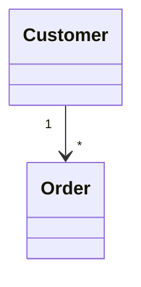

# Mermaid Class Diagram

## Overview

Use this skill to generate or fix Mermaid class diagrams that will live inside Markdown code blocks. Keep general Mermaid guidance brief and focused on the code block wrapper.

## Quick Start (Markdown)

Produce Mermaid diagrams inside fenced code blocks:



Only include enough general Mermaid guidance to orient the user on the ` ```mermaid ` code fence and where the diagram text goes.

## Workflow

1. Identify the classes and relationships from the user request (names, attributes, methods, cardinalities).
2. Choose the class diagram constructs needed (inheritance, composition, aggregation, associations, generics).
3. Produce a minimal correct diagram first; then add attributes/methods.
4. Validate syntax consistency: `classDiagram` header, class blocks, relation arrows, and labels.
5. Return only the Mermaid code block unless the user needs explanation.

## Common Patterns

- **Class body**: attributes then methods, each on its own line.
- **Visibility**: `+` public, `-` private, `#` protected, `~` package.
- **Relationships**: `--|>` inheritance, `*--` composition, `o--` aggregation, `-->` association, `..>` dependency.
- **Cardinality labels**: use quoted strings, e.g., `"1"`, `"*"`, `"0..1"`.
- **Generics**: use `Class~T~` in Mermaid class names.
- **Interfaces**: use `class Interface { <<interface>> }` and implement with `..|>`.

## Output Rules

- Prefer a single ` ```mermaid ` block.
- Keep names ASCII and concise unless the user provided specific names.
- Avoid extra commentary unless explicitly requested.

## References

Use `references/classdiagram.md` for the full syntax list and examples. Read it when you need specific arrow syntax, modifiers, or edge cases.
