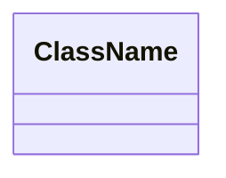
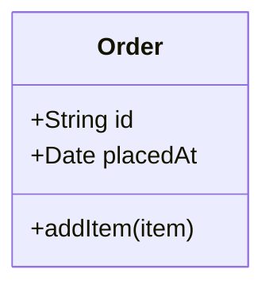
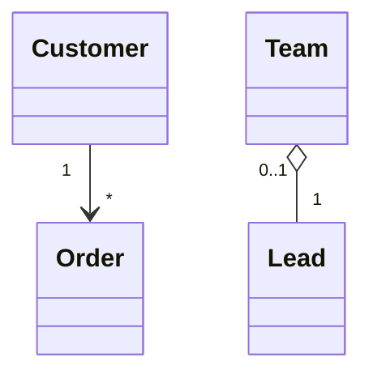
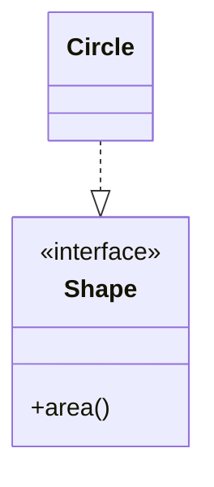
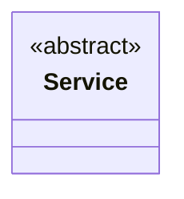

# Mermaid classDiagram reference

Use this reference when you need exact syntax, relationship arrows, or edge cases.

## Minimal template

## Class blocks

## Visibility modifiers

- `+` public
- `-` private
- `#` protected
- `~` package

## Relationships

- **Inheritance**: `Child --|> Parent`
- **Realization (interface)**: `Impl ..|> Interface`
- **Association**: `A --> B`
- **Dependency**: `A ..> B`
- **Aggregation**: `Whole o-- Part`
- **Composition**: `Whole *-- Part`

## Cardinality labels

Place quoted multiplicities near the ends:

## Names, generics, and namespaces

- Use ASCII names unless the user specifies otherwise.
- Generics: `Class~T~`
- Namespaces: `namespace Foo { class Bar }`

## Interfaces and annotations

## Notes and comments

- Notes: `note for ClassName "text"`
- Comments: `%% this is a comment`

## Common mistakes

- Missing `classDiagram` header.
- Unquoted cardinalities.
- Mixing up `--|>` vs `..|>`.
- Putting attributes/methods outside the class block.
